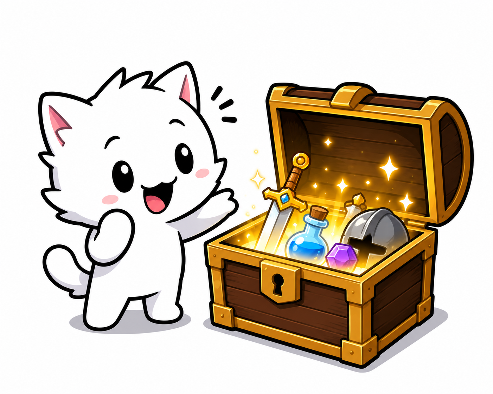

<h1 align="center">🎁 Chest Simulator 🎁</h1>

  

  A simple chest opening simulator I made while learning JavaScript!

Open chests, get random items with different rarities, manage your inventory, and sell items to earn coins.

## 🎮 Features

- Open chests for 100 coins
- Random item drops
- 5 different rarities:
  - Common
  - Uncommon
  - Rare
  - Epic
  - Legendary
- 13 different items
- Inventory system with a maximum of 12 items
- Sell items for coins
- Inventory counter
- Different colors for each rarity
- Session saving using `sessionStorage`

## 🛠️ Made With

- HTML
- CSS
- JavaScript

## 🎲 Rarity Chances

| Rarity | Chance |
|---|---:|
| Common | 45% |
| Uncommon | 30% |
| Rare | 15% |
| Epic | 8% |
| Legendary | 2% |

## 🚀 Play

You can play Chest Simulator here:

https://kevinhuskykb.github.io/Chest-Simulator/

## 📚 About

I made this project while learning JavaScript to practice things like objects, arrays, functions, DOM manipulation, random numbers, storage, and event handling.

This is one of my first JavaScript projects!
